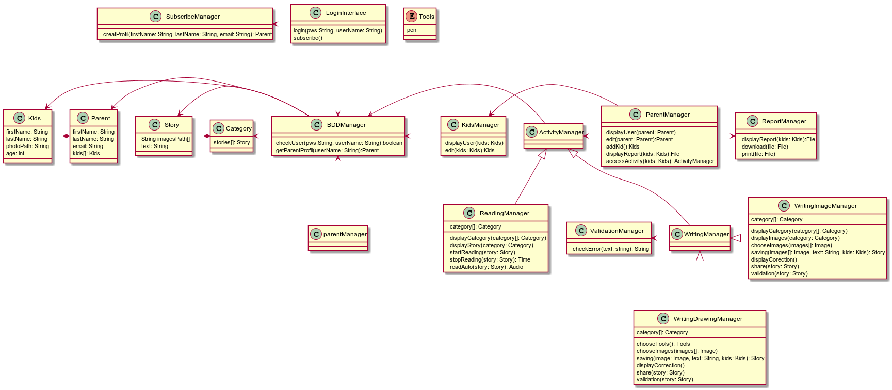

# Raconte-Moi

Raconte-moi est une super application destinée aux nos enfants entre 8 ans et 11 ans qui souhaitent améliorer leur lecture et écriture.
Cette application présente des activités qui utilisent des outils visuels pour attirer l'attention des enfants et joindre l'outil à l'agréable. Après création d'un compte l'utilisateur pourra choisir différentes activités à savoir la lecture ou l'écriture à travers des images, des animations ou des dessins. Un système de correction sera mis en place pour la correction des fautes grammaticales et d'orthographe. Une évaluation sera mise en place avec un rapport pédagogique afin de permettre aux parents de connaître l'évolution de leurs enfants. 

# Conditions préalables
Les outils à mettre en place pour le développements de l'application sont: 
- Android Studio 
- Github
- Jenkins 
- Sonarqube
- Trello

# Pose
Notre application sera sur Android Studio qui s'utilise assez facilement. Pour lancer le programme il faut cliquer sur un bouton RUN

# Exécution les tests
Il faudra faire les tests suivants : 
$> git clone https://github.com/xx.git
$> cd xxx
$> ./gradlew build
$> ./gradlew ckeck
$> ./gradlew sonarqube

# Décomposition en bout à bout des tests

/* Expliquer ce que ces tests tests et pourquoi */

# Déploiement 
Nous pouvons Play Store qui permettra de télécharger sur des périphériques mobiles compatibles avec Android.... A continuer

#Diagramme de classe

  

# Date
Le 17 Janvier 2017

# Auteurs 
BENZAIT Zakaria
MASLOUHI Nadia
SOW Sokhna Maimouna
